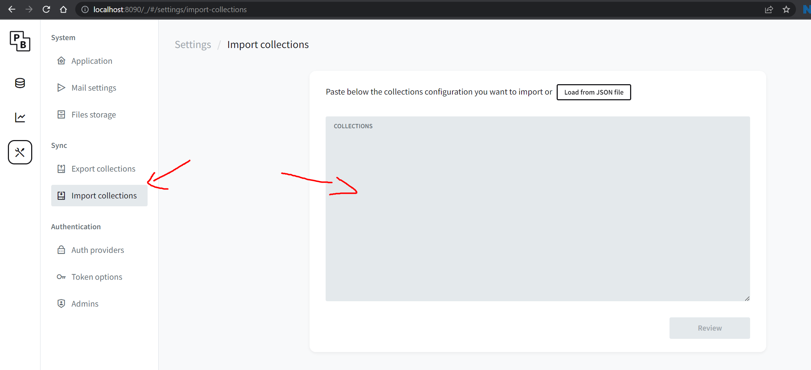

# install:

- npm i  

# start in dev:

start sveltekit:  

- npm run dev  
  start pocketbase:  
- docker-compose -f .\docker-compose-infra.yml up -d  

Setup pocketbase collection:  
copy json from file: import_pocketbase_collection
into pocketbase:

everything is working now  

# start in docker:

first turn off pocketbase  

- docker-compose down  
  then just run  
- docker-compose up -d  

app will be available on localhost:5050  
pocketbase is still on localhost:8090  
